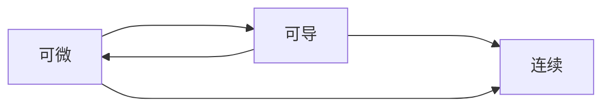

# 2.1 导数与微分

## 定义

1. 可导 $\Leftrightarrow$ <!-- cloze -->左右导数都存在且相等<!-- cloze -->．
2. 闭区间上可导 $\Leftrightarrow$ <!-- cloze -->开区间可导 + 区间端点的左 / 右导数存在<!-- cloze -->．
3. 导函数 $\Leftrightarrow$ <!-- cloze -->开区间可导<!-- cloze -->
4. 可微 $\Leftrightarrow$ <!-- cloze -->$\Delta y=A\Delta x+o(\Delta x)\ ,\ (\Delta x\to 0)$<!-- cloze --> $\Leftrightarrow$ <!-- cloze -->可导，且有 $dy=f^{'}(x_0)\Delta x=f^{'}(x_0)dx$<!-- cloze -->．
5. $\Delta y$ 的几何意义：<!-- cloze -->曲线上的增量<!-- cloze -->．
6. 微分 $dy$ 的几何意义：<!-- cloze -->切线上的增量<!-- cloze -->．

<!-- extra -->

[[Proof 2]]
<!-- extra -->

## 性质

### 基本初等函数的导数公式

#### $(C)^{\prime}$

<!-- basic -->

$$
(C)^{\prime}=0
$$

<!-- basic -->

#### $\left(x^{\alpha}\right)^{\prime}$

<!-- basic -->

$$
\left(x^{\alpha}\right)^{\prime}=\alpha x^{\alpha-1}
$$

<!-- basic -->

#### $\left(a^{x}\right)^{\prime}$

<!-- basic -->

$$
\left(a^{x}\right)^{\prime}=a^{x} \ln a
$$

<!-- basic -->

#### $\left(e^{x}\right)^{\prime}$

<!-- basic -->

$$
\left(e^{x}\right)^{\prime}=e^{x}
$$

<!-- basic -->

#### $\left(\log _{a} x\right)^{\prime}$

<!-- basic -->

$$
\left(\log _{a} x\right)^{\prime}=\frac{1}{x \ln a}
$$

<!-- basic -->

#### $(\ln |x|)^{\prime}$

<!-- basic -->

$$
(\ln |x|)^{\prime}=\frac{1}{x}
$$

<!-- basic -->

#### $(\sin x)^{\prime}$

<!-- basic -->

$$
(\sin x)^{\prime}=\cos x
$$

<!-- basic -->

#### $(\cos x)^{\prime}$

<!-- basic -->

$$
(\cos x)^{\prime}=-\sin x
$$

<!-- basic -->

#### $(\tan x)^{\prime}$

<!-- basic -->

$$
(\tan x)^{\prime}=\sec ^{2} x
$$

<!-- basic -->

#### $(\cot x)^{\prime}$

<!-- basic -->

$$
(\cot x)^{\prime}=-\csc ^{2} x
$$

<!-- basic -->

#### $(\sec x)^{\prime}$

<!-- basic -->

$$
(\sec x)^{\prime}=\sec x \tan x
$$

<!-- basic -->

#### $(\csc x)^{\prime}$

<!-- basic -->

$$
(\csc x)^{\prime}=-\csc x \cot x
$$

<!-- basic -->

#### $(\arcsin x)^{\prime}$

<!-- basic -->

$$
(\arcsin x)^{\prime}=\frac{1}{\sqrt{1-x^{2}}}
$$

<!-- basic -->

#### $(\arccos x)^{\prime}$

<!-- basic -->

$$
(\arccos x)^{\prime}=-\frac{1}{\sqrt{1-x^{2}}}
$$

<!-- basic -->

#### $(\arctan x)^{\prime}$

<!-- basic -->

$$
(\arctan x)^{\prime}=\frac{1}{1+x^{2}}
$$

<!-- basic -->

#### $(\operatorname{arccot} x)^{\prime}$

<!-- basic -->

$$
(\operatorname{arccot} x)^{\prime}=-\frac{1}{1+x^{2}}
$$

<!-- basic -->

### 求导法则

#### 有理运算求导

#### 复合函数求导

##### 隐函数求导

##### 反函数求导

函数和反函数的导数互为倒数，这是因为函数的导数是 $y$ 关于 $x$ 的切线，而反函数的导数是 $x$ 关于 $y$ 的切线，两者对应的角是互补的，而切线的斜率是这个角的正切值，故是互补的．

[[Prob 45]]

##### 参数方程求导

###### 一阶导数

###### 二阶导数

##### 对数求导

[[Prob 46]]

#### 高阶导数求导

##### $(\sin x)^{(n)}$

<!-- basic -->

$$
(\sin x)^{(n)}=\sin \left(x+n \cdot \frac{\pi}{2}\right)
$$

<!-- basic -->

<!-- extra -->

[[Prob 44]]

<!-- extra -->

##### $(\cos x)^{(n)}$

<!-- basic -->

$$
(\cos x)^{(n)}=\cos \left(x+n \cdot \frac{\pi}{2}\right)
$$

<!-- basic -->

##### $(u\pm v)^{(n)}$

<!-- basic -->

$$
(u \pm v)^{(n)}=u^{(n)} \pm v^{(n)}
$$

<!-- basic -->

##### $(uv)^{(n)}$

<!-- basic -->

$$
(u v)^{(n)}=\sum_{k=0}^{n} C_{n}^{k} u^{(k)} v^{(n-k)}
$$

<!-- basic -->

## 题型

### 导数定义

1. 设 $\varphi(x)$ 连续，则 $f(x)=\varphi(x)|x-a|$ 在 $x=a$ 可导 $\Leftrightarrow$ <!-- cloze -->$\varphi(a)=0$<!-- cloze --> ．

### 复合函数、隐函数、参数方程求导

### 高阶导数

1. 公式
2. 归纳法
3. 泰勒公式（只能求某一点的高阶导数）

[[Prob 47]]

[[Prob 48(待整理)]]

### 导数的应用

#### 导数的几何意义

1. 求切线
    1. 直角坐标系
    2. 参数方程
    3. 极坐标系

        [[Prob 49(待整理)]]

#### 相关变化率

[[Prob 50]]
